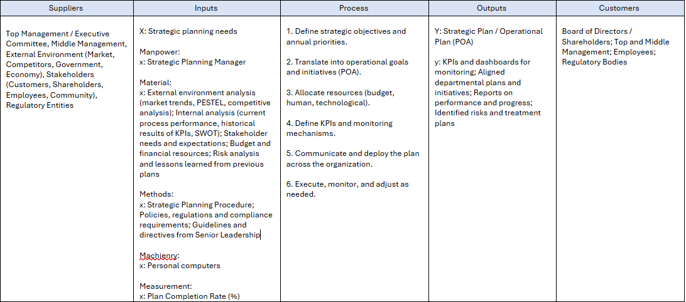
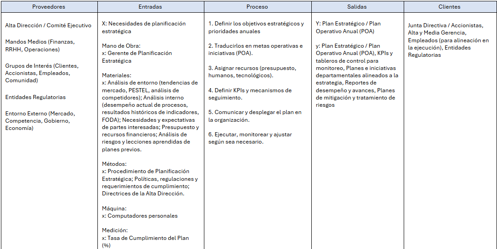
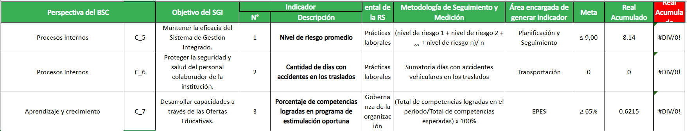
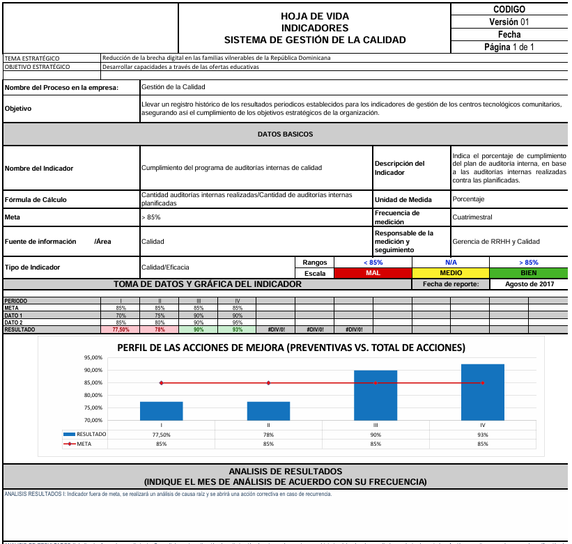
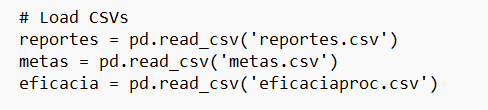
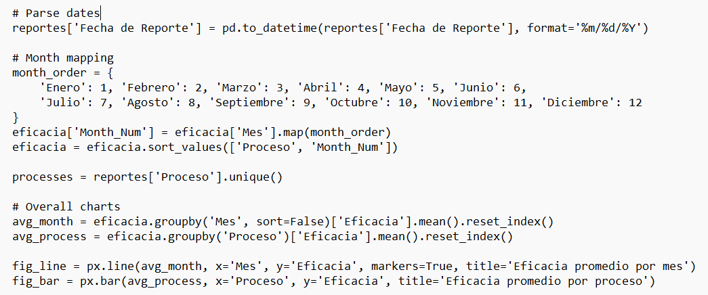
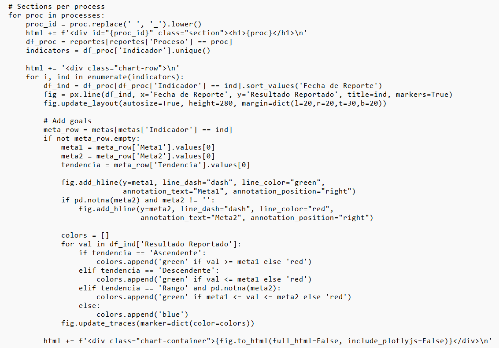
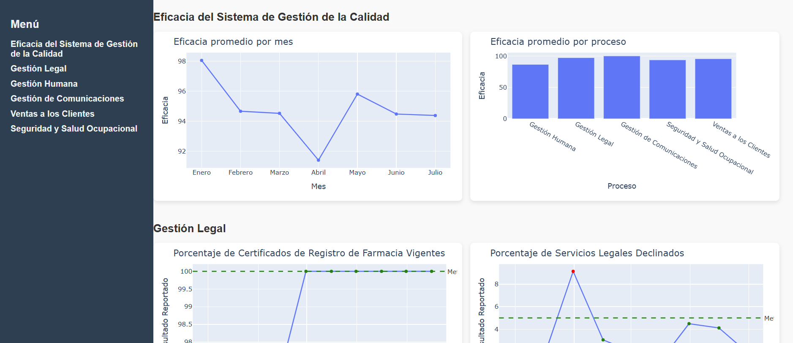

# Process Indicators Dashboard / Dashboard de Indicadores de Procesos

<!-- Badges -->

## Libraries Used / Librerías Utilizadas

- **pandas** → data handling and transformation / manejo y transformación de datos  
- **plotly.express** → quick generation of interactive charts / generación rápida de gráficos interactivos  
- **plotly.graph_objects** → advanced chart customization / personalización avanzada de gráficos  
- **os, datetime** → system and date handling / manejo de sistema y fechas  
- **HTML + CSS** → dashboard rendering and responsive design / renderizado y diseño responsivo del dashboard 

## Tech Stack / Tecnologías

| Layer / Capa       | Tools / Herramientas                          |
|-------------------|-----------------------------------------------|
| Data Handling      | Python, pandas                                |
| Visualization      | Plotly (Express + Graph Objects)             |
| Frontend           | HTML, CSS (Flexbox, responsive design)       |
| Automation         | Python scripts (ETL)                          |
| Hosting            | GitHub Pages / local execution               |

## Project overview:

**English:**
This project demonstrates my ability to transform semi-structured and unstructured data into actionable insights. I built an interactive KPI dashboard in Python + Plotly, replicating the structure of a corporate webpage.

Beyond dashboard development, I have experience designing process indicators in collaboration with top management and process owners, ensuring alignment with the organization’s strategic vision, strategic objectives, and annual operating plans (POA).

However, this specific project focuses on the design of a tool for the automated extraction and visualization of process indicator results, providing stakeholders with an agile and interactive way to monitor performance.

**Español:**
Este proyecto demuestra mi capacidad para transformar datos semi-estructurados y no estructurados en información accionable. Creé un dashboard interactivo de KPIs en Python + Plotly, que replica la estructura de una página corporativa.

Más allá del desarrollo del dashboard, cuento con experiencia en el diseño de indicadores de procesos en conjunto con la Alta Dirección y los dueños de procesos, asegurando la alineación con la visión estratégica, los objetivos estratégicos y los planes operativos anuales (POA).

No obstante, este proyecto en particular se enfoca en el diseño de una herramienta para la extracción automatizada y visualización de los resultados de los indicadores de procesos, brindando a las partes interesadas una forma ágil e interactiva de dar seguimiento al desempeño.

## Project Specs

**English:**
The dashboard centralizes process KPIs, automates data extraction from diverse sources, and provides interactive visualizations for stakeholders.

**Español:**
El dashboard centraliza KPIs de procesos, automatiza la extracción de datos de diversas fuentes y entrega visualizaciones interactivas para las partes interesadas.

Note / Nota:

Indicator names were modified.

Data was altered for privacy.

## Process

**English:** The organization deployed its strategic plan using the Hoshin Kanri methodology, ensuring alignment between long-term strategy and daily operations.

This project focuses on the **ETL process and the visualization of process indicators**, enabling efficient monitoring and decision-making.

The execution of the methodology is described in the SIPOC below, which captures inputs, resources, and process steps for strategic planning:

The strategy deployment had the following structure:

- **STRATEGIC VISION**
- **STRATEGIC MISSION**
- **BSC PERSPECTIVE**
- **INTEGRATED MANAGEMENT SYSTEM OBJECTIVE**
- **PROCESS INDICATOR**

**Español:** La organización desplegó su plan estratégico utilizando la metodología Hoshin Kanri, asegurando la alineación entre la estrategia de largo plazo y la operación diaria.

Este proyecto corresponde al **proceso ETL y la visualización de los indicadores de proceso**, permitiendo un monitoreo eficiente y la toma de decisiones.

La ejecución de la metodología se describe en el SIPOC siguiente, que captura entradas, recursos y pasos clave de la planificación estratégica:

El despliegue de la estrategia tuvo la siguiente estructura:

- **VISIÓN ESTRATÉGICA**
- **MISIÓN ESTRATÉGICA**
- **PERSPECTIVA DEL BSC**
- **OBJETIVO DEL SISTEMA DE GESTIÓN INTEGRADO**
- **INDICADOR DE PROCESO**

## Tools for documenting the planning process / Herramientas para documentar el proceso de planificación

1. **Objectives and KPI Matrix / Matriz de Objetivos e Indicadores**  
A tool used to align strategic objectives with measurable indicators (KPIs), showing which metrics track the achievement of each goal. It helps ensure that every objective has clear and measurable outcomes.  
_Una herramienta utilizada para alinear los objetivos estratégicos con indicadores medibles (KPIs), mostrando qué métricas rastrean el cumplimiento de cada objetivo. Ayuda a garantizar que cada objetivo tenga resultados claros y medibles._  

   

2. **KPI Sheet / Ficha de Indicadores**  
A document that provides detailed information about each performance indicator, including its definition, calculation method, target values, responsible owner, and frequency of measurement. It is used to standardize and monitor KPIs across processes.  
_Documento que proporciona información detallada sobre cada indicador de desempeño, incluyendo su definición, método de cálculo, valores objetivo, responsable y frecuencia de medición. Se utiliza para estandarizar y monitorear los KPIs a lo largo de los procesos._  

   

## Main Challenge

**English:**
The hardest part was capturing data from multiple sources, most of them unstructured.

The Sales to Clients process data was extracted from SQL Server via query.

Other indicators came from reporting tools.

Example: For the % of legal services completed on time, I built a Power Automate app that fed a SharePoint list with internal client requests.

To ensure data integrity, a Python-based ETL pipeline was built to extract, consolidate, and validate the data automatically, reducing manual errors.

In this portfolio, the centralized datasets are shown:

[reportes.csv](./reportes.csv) → raw centralized reports.

[metas.csv](./metas.csv) → goals and thresholds for KPIs.

[eficaciaproc.csv](./eficaciaproc.csv) → process performance over time.

**Español:**
El mayor reto fue capturar datos de múltiples fuentes, en su mayoría no estructuradas.

El proceso de Ventas a Clientes se extrajo desde SQL Server con un query.

Otros indicadores provenían de herramientas de reporte.

Ejemplo: Para el % de servicios legales completados en plazo, se creó una app en Power Automate que alimentaba una lista de SharePoint con solicitudes de clientes internos.

Para garantizar la integridad de los datos, se construyó un pipeline ETL en Python que extraía, consolidaba y validaba los datos automáticamente, reduciendo errores manuales.

En este portafolio se muestran las tablas centralizadas:

[reportes.csv](./reportes.csv) → reportes centralizados.

[metas.csv](./metas.csv) → metas y umbrales de KPIs.

[eficaciaproc.csv](./eficaciaproc.csv) → desempeño de procesos por mes.

## How It Works / Cómo Funciona

**English**
This KPI Dashboard program is a Python-based alternative to Power BI, allowing you to visualize KPIs interactively in a web browser (You can try the program [here](./kpisgc2.py)). Here's how it works:

1. **Data Loading:**  
   The program reads three CSV files: `reportes.csv` (indicator reports), `metas.csv` (targets for each indicator), and `eficaciaproc.csv` (effectiveness per process).

2. **Data Processing:**  
   - Dates are parsed into `datetime` objects.  
   - Monthly KPIs are sorted in the correct order using a month mapping.  
   - Effectiveness is grouped by month and process for overall charts.

3. **Visualization:**  
   - Line charts show KPI trends over time.  
   - Bar charts show average effectiveness per process.  
   - For each process and indicator, individual charts are created with dynamic coloring:  
     - Green if the KPI meets or exceeds the target  
     - Red if it falls below the target  
     - Ranges are handled when two targets are specified.

4. **Dashboard Rendering:**  
   - An HTML template with CSS flexbox layout displays the charts.  
   - Charts are arranged **two per row** in a responsive, scroll-free layout.  
   - A sidebar allows navigation between the overall dashboard and each process.

5. **Execution:**  
   - Run the Python script, and it automatically generates the `sgc_dashboard.html` file.  

   - Open this file in a web browser to interact with your KPI dashboard. You can try visualizing the example dashboard [here](https://rafaelpb87.github.io/portfolioweb/).

**Español**
Este programa de Dashboard de KPIs es una alternativa basada en Python a Power BI, que permite visualizar los indicadores de manera interactiva en un navegador web (Puede probar el programa [aquí](./kpisgc2.py)). Su funcionamiento es el siguiente:

1. **Carga de Datos:**  
   El programa lee tres archivos CSV: `reportes.csv` (informes de indicadores), `metas.csv` (metas de cada indicador) y `eficaciaproc.csv` (eficacia por proceso).

2. **Procesamiento de Datos:**  
   - Se convierten las fechas a objetos `datetime`.  
   - Los KPIs mensuales se ordenan correctamente usando un mapeo de meses.  
   - La eficacia se agrupa por mes y por proceso para generar gráficos generales.

3. **Visualización:**  
   - Gráficos de línea muestran la evolución de los KPIs a lo largo del tiempo.  
   - Gráficos de barras muestran la eficacia promedio por proceso.  
   - Para cada proceso e indicador, se generan gráficos individuales con color dinámico:  
     - Verde si el KPI cumple o supera la meta  
     - Rojo si queda por debajo de la meta  
     - Se manejan rangos cuando se especifican dos metas.

4. **Renderizado del Dashboard:**  
   - Una plantilla HTML con diseño flexbox de CSS muestra los gráficos.  
   - Los gráficos se organizan **dos por fila** en un diseño responsive sin scroll horizontal.  
   - Una barra lateral permite navegar entre el dashboard general y cada proceso.

5. **Ejecución:**  
   - Ejecuta el script de Python, y automáticamente se genera el archivo `sgc_dashboard.html`.  

   - Abre este archivo en un navegador web para interactuar con tu dashboard de KPIs. Puede visualizar el dashboard con los datos de ejemplo [aquí](https://rafaelpb87.github.io/portfolioweb/).

## Features

English:
KPI results and specifications loaded from .csv files

Dynamic coloring of results (green/red based on compliance)

Automatic ETL: running the Python script extracts, transforms, and loads new data into the dashboard

Español:
Resultados y especificaciones de KPIs cargados desde archivos .csv

Coloreado dinámico de resultados (verde/rojo según el cumplimiento)

ETL automático: al ejecutar el script en Python se extraen, transforman y cargan los nuevos datos en el tablero

**Hoshin Kanri Alignment**

English:
The project was designed within the framework of Hoshin Kanri (Policy Deployment) — a strategic planning methodology that aligns an organization’s long-term vision (True North) with annual objectives, KPIs, and daily operations.
By centralizing KPIs and automating their validation, this dashboard ensures data integrity and provides stakeholders with reliable insights to monitor strategic execution.

Español:
El proyecto fue diseñado en el marco de Hoshin Kanri (Despliegue de Políticas), una metodología de planeación estratégica que alinea la visión de largo plazo (True North) con objetivos anuales, KPIs y operaciones diarias.
Al centralizar KPIs y automatizar su validación, este dashboard asegura la integridad de los datos y brinda a las partes interesadas información confiable para monitorear la ejecución de la estrategia.

## Benefits
Why Python + Plotly instead of Power BI?

English:
**While Power BI is a strong BI tool, Python + Plotly offers:**

Handles semi-structured and unstructured data (APIs, logs, SharePoint)

Automated ETL: just run the program, and the dashboard refreshes with new data

No licenses required: dashboards run in any browser as .html

Advanced analytics ready: integrates with ML, NLP, and statistics libraries

Full design control beyond Power BI’s format limitations

**Best for:**

Heterogeneous or semi-structured data sources

Fully automated reporting pipelines

Companies avoiding Power BI licensing costs

Dashboards that need predictive/advanced analytics

Español:
**Aunque Power BI es excelente, Python + Plotly ofrece ventajas:**

Manejo de data semi-estructurada y no estructurada (APIs, logs, SharePoint)

ETL automatizado: basta con ejecutar el programa y el dashboard se refresca con nueva data

Sin licencias: los dashboards funcionan en cualquier navegador como .html

Analítica avanzada lista: integración con ML, NLP y librerías estadísticas

Control total de diseño más allá de las restricciones de Power BI

**Especialmente útil cuando:**

Las fuentes son heterogéneas o semi-estructuradas

Se necesita automatizar reportes de principio a fin

Se quiere evitar costos de licencias Power BI

Se deben integrar modelos predictivos o analítica avanzada
